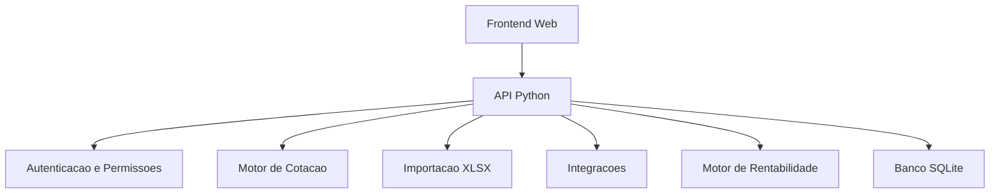
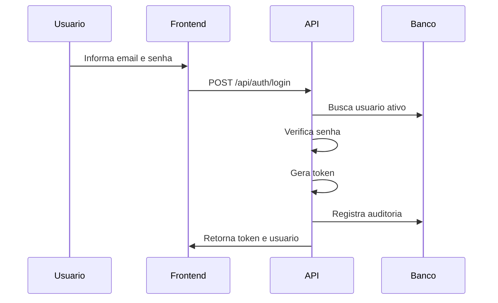
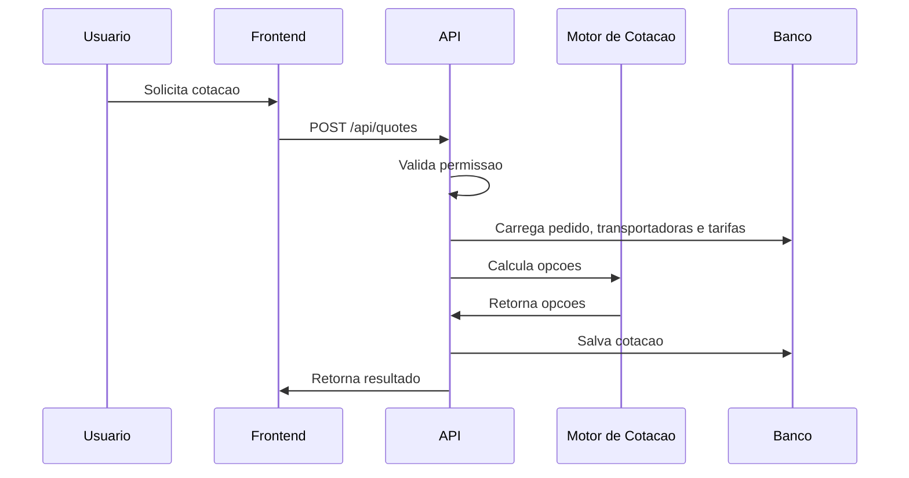
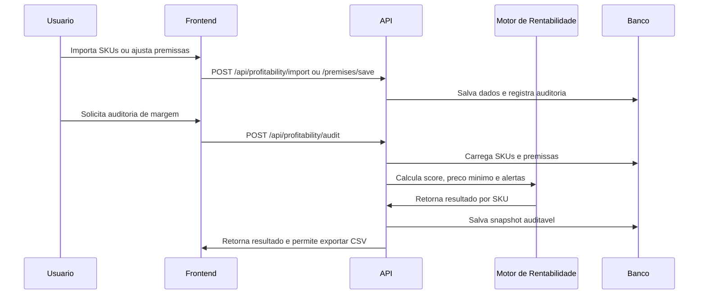
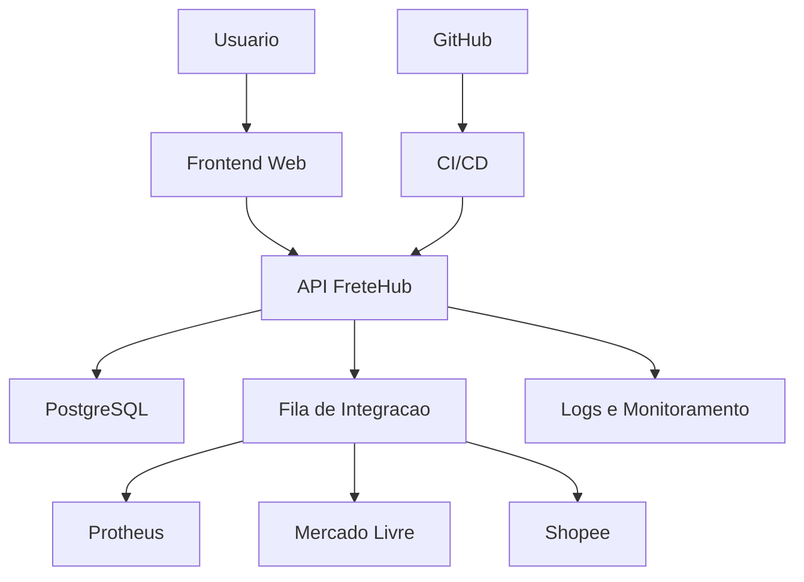

# FreteHub V2 - Arquitetura da Aplicacao

## Visao geral

O FreteHub V2 e uma aplicacao web full-stack para gestao de fretes, composta por frontend web, API Python, banco SQLite local e modulos de dominio para cotacao, permissoes, importacao e integracoes.

A arquitetura atual foi desenhada para MVP funcional. Ela permite evoluir o produto sem quebrar a V1 demonstrativa.

## Versoes

### V1 demonstrativa

Arquivos:

- `index.html`
- `app.js`
- `styles.css`

Uso:

- Demo estatica.
- Pode ser publicada no GitHub Pages.
- Nao depende de backend.

### V2 operacional

Arquivos:

- `apps/web/index.html`
- `apps/web/app.js`
- `apps/web/styles.css`
- `server/app.py`
- `server/fretehub/*`
- `tests/*`

Uso:

- Aplicacao com backend e banco.
- Deve rodar localmente ou em servidor com Python.
- Base para operacao real e futuras integracoes.

## Estrutura de camadas



## Frontend

Local:

```text
apps/web/
```

Responsabilidades:

- Login.
- Navegacao lateral.
- Dashboard.
- Pedidos.
- Simulador.
- Transportadoras.
- Tarifas.
- Integracoes.
- Canais de venda.
- Relatorios.
- Auditoria.
- Configuracoes.
- Usuarios.
- Rentabilidade Marketplace.

Caracteristicas:

- HTML, CSS e JavaScript puro.
- Sem etapa de build.
- Baixa complexidade de instalacao.
- Boa velocidade para MVP.

Limitacoes:

- Estado e validacoes ainda dependem muito do JavaScript da tela.
- Nao ha componentes reutilizaveis formais.
- Para crescimento grande, pode valer migrar para React, Vue ou similar.

## Backend/API

Arquivo principal:

```text
server/app.py
```

Responsabilidades:

- Servir a V2.
- Expor endpoints `/api`.
- Autenticar usuarios.
- Aplicar permissoes.
- Consultar e gravar dados.
- Coordenar cotacao, importacao e integracoes.

Caracteristicas:

- Python com biblioteca padrao.
- Sem dependencias externas obrigatorias.
- Simples para rodar localmente.

Limitacoes:

- `server/app.py` concentra muitas responsabilidades.
- O servidor atual e adequado para MVP, mas nao e ideal para producao.
- Recomendacao futura: migrar API para FastAPI ou Flask.

## Modulos de dominio

### `auth.py`

Responsavel por:

- Hash de senha.
- Verificacao de senha.
- Criacao e leitura de token.

### `permissions.py`

Responsavel por:

- Regras de acesso por perfil.
- Validacao de permissoes.

### `quote_engine.py`

Responsavel por:

- Validar dados de cotacao.
- Calcular peso cubado.
- Encontrar tarifas validas.
- Calcular valor do frete.
- Marcar opcao recomendada.

### `profitability_engine.py`

Responsavel por:

- Calcular preco minimo por marketplace.
- Calcular lucro estimado e margem por SKU.
- Gerar score de rentabilidade.
- Detectar risco de prejuizo e cubagem.
- Retornar acao recomendada para decisao comercial.

### `xlsx_importer.py`

Responsavel por:

- Ler XLSX.
- Importar pedidos.
- Importar tarifas.
- Retornar erros por linha.

### `integrations.py`

Responsavel por:

- Status demonstrativo das integracoes.
- Base para evoluir conectores reais.

## Banco de dados

Banco atual:

```text
server/data/fretehub.sqlite
```

Tecnologia:

- SQLite.

Uso recomendado:

- Desenvolvimento local.
- Demo.
- Homologacao pequena.

Para producao:

- PostgreSQL gerenciado.
- Backup automatico.
- Variavel de ambiente para string de conexao.
- Migracoes controladas.

## Fluxo de autenticacao



## Fluxo de cotacao



## Fluxo de rentabilidade marketplace



## Ambientes recomendados

### Local

Uso:

- Desenvolvimento.
- Testes manuais.
- Validacao rapida.

Banco:

- SQLite local.

### Homologacao

Uso:

- Validacao com usuarios.
- Teste de novas telas.
- Teste de integracoes em ambiente seguro.

Banco:

- PostgreSQL ou SQLite isolado.

### Producao

Uso:

- Operacao real.

Banco:

- PostgreSQL gerenciado.

Obrigatorio:

- HTTPS.
- Backup.
- Logs.
- Segredos fora do codigo.
- Monitoramento.

## Arquitetura-alvo



## Pontos fortes atuais

- V1 preservada.
- V2 com backend real.
- Banco inicial funcionando.
- Autenticacao e permissoes.
- Motor de cotacao separado.
- Motor de rentabilidade separado.
- Testes automatizados para partes criticas.
- Modelo de dados ja preparado para operacao mais completa.
- Telas aderentes ao fluxo real de frete.

## Riscos arquiteturais

| Risco | Impacto | Acao recomendada |
|---|---|---|
| API concentrada em um arquivo | Manutencao dificil | Separar rotas e servicos |
| SQLite em producao | Risco em multiusuario | Migrar para PostgreSQL |
| Segredos no banco sem criptografia forte | Risco de seguranca | Criptografar credenciais |
| Sem fila real | Integracoes frageis | Criar fila/reprocessamento |
| Sem CI/CD | Deploy manual arriscado | Criar pipeline no GitHub |
| Sem observabilidade | Erros dificeis de diagnosticar | Adicionar logs estruturados |
| Premissas comerciais desatualizadas | Decisoes de margem incorretas | Revisar premissas por marketplace periodicamente |

## Recomendacao tecnica

Manter a arquitetura atual ate fechar a V2 funcional. Depois, evoluir em ordem:

1. Documentar API.
2. Separar `server/app.py` em rotas e servicos.
3. Migrar banco para PostgreSQL.
4. Criar deploy de homologacao.
5. Implementar logs estruturados.
6. Criar fila de integracoes.
7. Evoluir para API com FastAPI.

