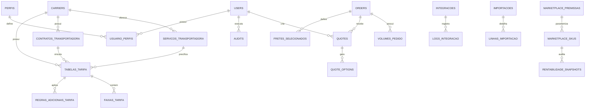

# FreteHub V2 - Modelo de Dados Operacional

## Objetivo

Descrever as entidades principais do FreteHub V2 e orientar a evolucao do banco para uso real.

O modelo atual atende MVP local e ja prepara o produto para gestao de pedidos, tarifas, transportadoras, cotacoes, integracoes e auditoria.

## Banco atual

Tecnologia:

- SQLite.

Arquivo:

```text
server/data/fretehub.sqlite
```

Uso recomendado:

- Desenvolvimento.
- Demo.
- Validacao local.

Uso nao recomendado:

- Producao multiusuario.
- Alto volume de pedidos.
- Integracoes concorrentes.

## Grupos de entidades

### Usuarios e acesso

Tabelas:

- `users`
- `perfis`
- `usuario_perfis`

Finalidade:

- Controlar quem acessa o sistema.
- Controlar perfil operacional.
- Permitir auditoria por usuario.

Regras:

- Email unico.
- Usuario inativo nao pode logar.
- Exclusao deve ser logica.
- Perfil determina permissao.

Melhorias recomendadas:

- Historico de alteracao de perfil.
- Politica de senha.
- Expiracao de sessao.
- Bloqueio por tentativas invalidas.

### Transportadoras

Tabelas:

- `carriers`
- `servicos_transportadora`
- `contratos_transportadora`

Finalidade:

- Representar transportadoras contratadas.
- Controlar modalidades/servicos.
- Controlar vigencia contratual.

Dados principais:

- Nome fantasia.
- Razao social.
- CNPJ.
- Status.
- Fator de cubagem.
- Estados atendidos.
- Prazo medio.
- Contrato.

Regras:

- Transportadora inativa nao deve ser recomendada.
- Contrato vencido deve gerar alerta.
- Servico inativo nao deve aparecer em nova tarifa.

### Tarifas

Tabelas:

- `rates`
- `tabelas_tarifa`
- `faixas_tarifa`
- `regras_adicionais_tarifa`

Finalidade:

- Armazenar regras de precificacao de frete.
- Controlar vigencia e versao.
- Permitir simulacao por rota, CEP, peso e valor.

Dados principais:

- Transportadora.
- Servico.
- Contrato.
- Versao.
- Vigencia.
- UF origem.
- UF destino.
- CEP inicial/final.
- Peso minimo/maximo.
- Frete base.
- Valor por kg excedente.
- Frete minimo.
- Prazo.
- Status.

Regras:

- Tarifa vencida nao deve ser usada.
- Tarifa deve ter vigencia.
- Duplicacao deve gerar nova versao.
- Faixa de CEP deve ser valida.
- Peso maximo deve ser maior ou igual ao minimo.

Melhorias recomendadas:

- Unificar gradualmente `rates` e `tabelas_tarifa`.
- Criar aprovacao formal de tarifas.
- Registrar usuario aprovador.
- Registrar motivo de alteracao de valor.

### Pedidos

Tabelas:

- `orders`
- `volumes_pedido`
- `historico_status_pedido`

Finalidade:

- Registrar pedidos recebidos de canais de venda.
- Manter dados necessarios para cotacao.
- Acompanhar status operacional.

Dados principais:

- Numero.
- Canal.
- Cliente.
- CEP origem.
- CEP destino.
- Cidade/UF destino.
- Valor do pedido.
- Peso real.
- Dimensoes.
- Volumes.
- Produtos.
- Status.
- Status Protheus.
- Status expedicao.

Regras:

- Numero do pedido deve ser unico.
- CEP deve ter 8 digitos.
- Peso e dimensoes devem ser maiores que zero.
- Pedido sem frete deve aparecer como pendente de cotacao.

Melhorias recomendadas:

- Separar cliente em entidade propria.
- Separar endereco em entidade propria.
- Registrar origem real do pedido.
- Guardar payload resumido do canal.

### Cotacoes

Tabelas:

- `quotes`
- `quote_options`
- `fretes_selecionados`

Finalidade:

- Registrar simulacoes.
- Guardar opcoes calculadas.
- Guardar frete escolhido.

Regras:

- Cotacao deve estar ligada a um pedido.
- Opcao deve estar ligada a uma cotacao.
- Frete selecionado deve ter transportadora, valor, prazo e motivo.
- Pedido deve ter somente um frete ativo.

Melhorias recomendadas:

- Versionar regra de cotacao usada.
- Guardar snapshot da tarifa aplicada.
- Guardar usuario que aprovou frete acima do limite.

### Integracoes

Tabelas:

- `integration_configs`
- `integracoes`
- `logs_integracao`
- `canais_venda`

Finalidade:

- Configurar Protheus, Mercado Livre, Shopee e Site Proprio.
- Registrar status de sincronizacao.
- Apoiar fila e reprocessamento.

Regras:

- Credenciais devem ser mascaradas na interface.
- Falhas devem gerar log.
- Reprocessamento deve registrar tentativa.
- Ambiente de homologacao e producao devem ser separados.

Melhorias recomendadas:

- Criptografar credenciais.
- Criar tabela de fila dedicada.
- Criar controle de webhook.
- Guardar correlation ID por evento.

### Rentabilidade Marketplace

Tabelas:

- `marketplace_premissas`
- `marketplace_skus`
- `rentabilidade_snapshots`

Finalidade:

- Controlar premissas comerciais por canal.
- Armazenar SKUs auditados por marketplace.
- Registrar snapshots de calculo para rastreabilidade.

Dados principais:

- Canal.
- SKU.
- Nome do produto.
- Custo do produto.
- Preco de venda.
- Custo de embalagem.
- Frete estimado.
- Frete gratis.
- Peso real.
- Dimensoes.
- Fator de cubagem.
- Comissao.
- Imposto.
- Ads.
- Parcelamento.
- Margem alvo.
- Resultado da auditoria.

Regras:

- SKU deve ser unico por canal.
- Premissas devem ser versionaveis na evolucao de producao.
- Auditoria deve guardar snapshot do resultado e da premissa aplicada, nao apenas o valor atual.
- Importacao deve validar SKU, nome, canal, custo e preco.
- Exportacao deve permitir conferencia externa em planilha.

Melhorias recomendadas:

- Vincular SKU aos itens reais do pedido.
- Criar historico de premissas por periodo.
- Integrar com custo real do ERP.
- Integrar com APIs de marketplaces para comissao e frete atualizado.

### Importacoes

Tabelas:

- `importacoes`
- `linhas_importacao`

Finalidade:

- Controlar arquivos importados.
- Registrar sucesso e falha por linha.
- Evitar duplicidade de arquivo.

Regras:

- Hash do arquivo deve ser unico.
- Linha com erro deve ser rastreavel.
- Importacao deve registrar usuario.

### Auditoria

Tabela:

- `audits`

Finalidade:

- Registrar acoes criticas.
- Apoiar suporte, rastreabilidade e investigacao.

Eventos recomendados:

- Login.
- Cadastro de usuario.
- Exclusao de usuario.
- Criacao/edicao de tarifa.
- Criacao/edicao de transportadora.
- Geracao de cotacao.
- Selecao de frete.
- Importacao.
- Integracao.

## Relacionamentos principais



## Governanca de dados

Dados sensiveis:

- Email de usuario.
- Nome de cliente.
- Credenciais de integracao.
- Dados operacionais de pedido.
- Custos, margens e premissas comerciais por SKU.

Cuidados necessarios:

- Mascarar credenciais.
- Evitar expor tokens.
- Restringir acesso por perfil.
- Registrar auditoria.
- Fazer backup.
- Definir politica de retencao de logs.

## Recomendacao para producao

1. Migrar para PostgreSQL.
2. Criar migrations versionadas por ferramenta propria.
3. Criar backups automaticos.
4. Criptografar credenciais.
5. Criar dicionario de dados completo.
6. Padronizar nomes de campos.
7. Criar indices para consultas por status, data, canal, UF, transportadora e tarifa.
8. Separar dados demonstrativos de dados reais.

